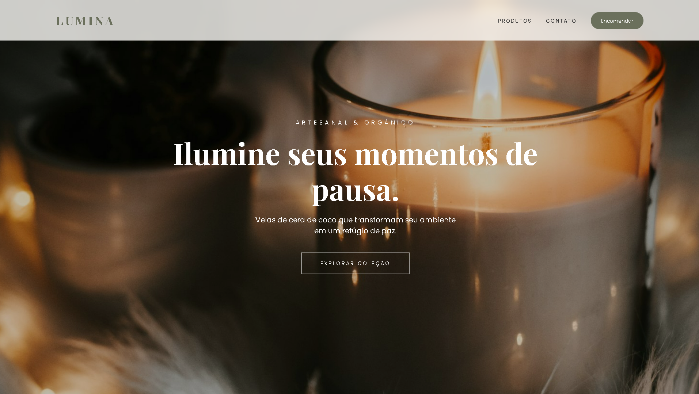
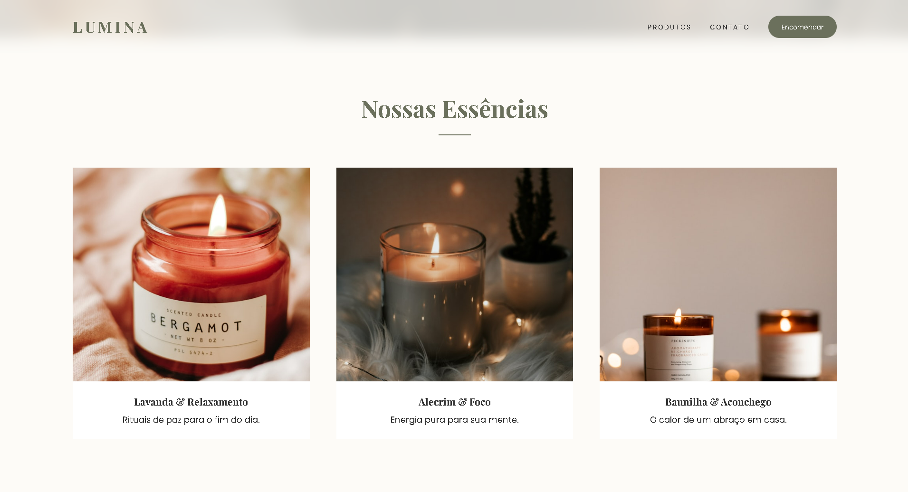
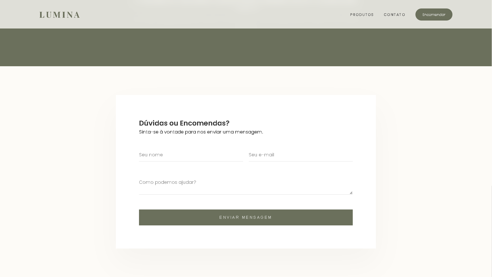

# Lumina Velas Artesanais | Interactive E-Commerce Experience

A premium, high-end landing page for artisanal organic candles. This project focuses on **Interactive Storytelling** through smooth animations, modern UI/UX principles, and a minimalist aesthetic inspired by luxury brands like Twinbru.

<p align="center">
  
</p>

---

## ✨ Key Features

* **Twinbru-Style Preloader:** A sophisticated loading sequence with a progress bar and brand pulse effect.
* **Magnetic Hero Header:** An interactive mouse-following effect on the main banner for a dynamic user experience.
* **Fluid Responsiveness:** Fully optimized for all devices, from **4K Televisions** and **Tablets** to **Smartwatches**.
* **Scroll Reveal Animations:** Elements fade and slide into place as the user explores the page using `IntersectionObserver`.
* **Modern Custom Scrollbar:** A thin, elegant "ghost" scrollbar that matches the brand's color palette.
* **Functional Contact Form:** Integrated with AJAX/Fetch API for real-time email submission without page reloads.
* **Testimonial Carousel:** A smooth, auto-playing slider for customer social proof.

---

## 🛍️ Product Collection

The interface features a dynamic grid that adapts to any screen size, showcasing our premium scents with hover effects and reveal animations.

<p align="center">
  
</p>

---

## 🛠️ Tech Stack

* **HTML5:** Semantic structure for better SEO and accessibility.
* **CSS3:** Custom properties (variables), Flexbox, CSS Grid, and `clamp()` for fluid typography.
* **JavaScript (ES6+):** Vanilla JS for high performance (No heavy libraries like jQuery).
* **Formspree API:** Backend-less form handling for real email delivery.
* **Google Fonts:** "Playfair Display" (Serif) and "Poppins" (Sans-serif).

---

## 📧 Seamless Contact Experience

Our contact section uses floating labels and real-time validation to ensure a premium feel while maintaining high functionality.

<p align="center">
  
</p>

---

## 🚀 Getting Started

### Prerequisites
You only need a modern web browser to run this project.

### Installation
1.  **Clone the repository:**
    ```bash
    git clone [https://github.com/devmgdp/lumina-velas-responsive.git](https://github.com/devmgdp/lumina-velas-responsive.git)
    ```
2.  **Navigate to the project folder:**
    ```bash
    cd lumina velas
    ```
3.  **Open the site:**
    Simply open `index.html` in your favorite browser.

---

## 📧 Form Setup

To make the contact form work for your own email:
1.  Create a free account at [Formspree.io](https://formspree.io/).
2.  Create a new form and copy your **Unique ID**.
3.  In `index.html`, update the form action:
    ```html
    <form action="[https://formspree.io/f/YOUR_ID_HERE](https://formspree.io/f/YOUR_ID_HERE)" method="POST">
    ```

---

## 📱 Responsiveness Grid

| Device | Optimization Strategy |
| :--- | :--- |
| **Desktop / TV** | Wide layouts with grid gaps and large fluid typography. |
| **Tablets** | Adaptive grids (2 columns) and touch-friendly buttons. |
| **Mobile** | Single column layout, 100svh hero height fix for mobile browsers. |
| **Wearables** | Ultra-compact scaling for screens under 280px. |

---

## 🎨 Credits & Assets

* **Images:** High-quality curated photos from [Unsplash](https://unsplash.com/).
* **Icons:** Minimalist SVG icons.
* **Design Inspiration:** Luxury interior design and organic wellness boutiques.

---

Developed by **Miguel Peixoto**.